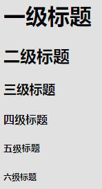
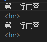
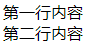
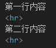
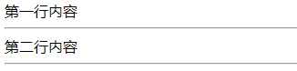
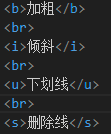
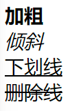
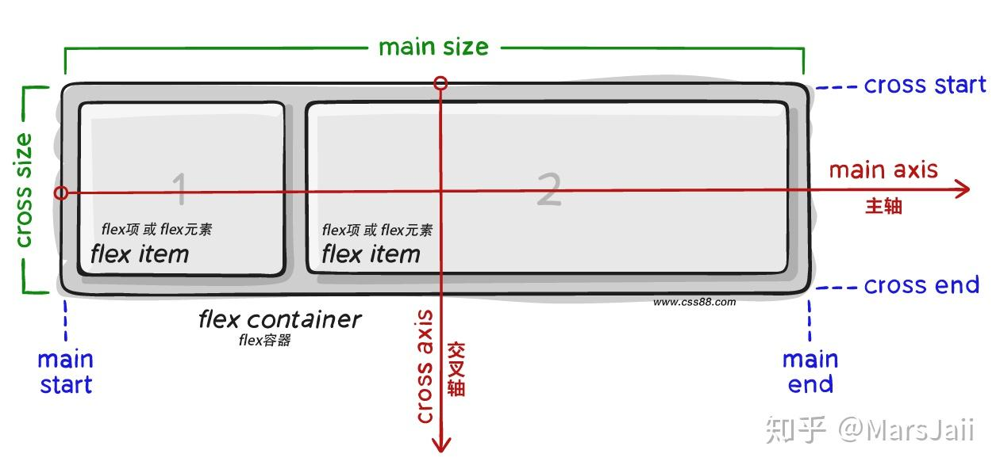

# **HTML**

## HTML 的定义
    HTML 超文本标记语言-- HyperText Markup Language
    超文本是什么? 	—— 链接
	标记是什么?	—— 标记也叫标签，带尖括号的文本

## 标签的语法
	

 - 标签**成对**出现，中间包裹内容
 - **<>里面**是标签名
 - 结束标签比开始标签多“/”，在标签名前面
 - 扩展
	 - **双标签**：成对出现的标签
	 - 单标签：只有开始标签，没有结束标签
			
			标签开头 ********** 标签结尾
			<lable>文本</lable>
		

## HTML 基本框架
```html
<html>
	<head>
		<title>网页标题</title>
	</head>
	<body>
		网页主体
	</body>
</html>
```
- html：	**整个网页**
- head：	**网页头部**，存放给**浏览器**看的代码，例如 CSS
- body：	**网页主体**，存放给**用户**看的代码，例如 图片、文字
- title：	**网页标题**

### VS Code快速生成框架
&ensp;&ensp;&ensp;&ensp;在HTML 文件 (.html) 中，!(英文) 配合 Enter / Tab 键

## 标签关系

- 父子关系（嵌套关系）
- 兄弟关系（并列关系）

## 注释
&ensp;&ensp;&ensp;&ensp;注释就是对代码的**解释和说明**，其目的是让人们能够更加轻松地了解代码。注释是编写程序时，写程序的人给一个语句、程序段、函数等的解释或提示，能**提高程序代码的可读性**。

&ensp;&ensp;&ensp;&ensp;在编写HTML代码时，我们经常要在一些关键代码旁做一下注释，这样做的好处很多，比如:**方便理解、方便查找或方便项目组里的其它程序员了解你的代码**，而且可以**方便以后你对自己代码进行修改**。

&ensp;&ensp;&ensp;&ensp;**<!--...-\->** 注释标签用来在源文档中插入注释，注释不会在浏览器中显示


## 标签
### 1、标题标签
标签名：**h1~h6**（**双**标签）1-六级
显示特定点
- 文字加粗
- **字号逐级递减**
- **独占一行**（换行）
- h1：一个网页就用一次


### 2、换行
\<br>：单标签
浏览器**不识别代码中的Enter键换行**


### 3、水平线
\<hr>：单标签


### 4、文本格式化
- strong / b：加粗
- em / i：倾斜
- ins/u：下划线
- del / s：删除线
- 
	
	两个文本格式化标签**在一行显示**
	**建议使用strong、em、ins、del标签**
	strong、em、ins、del标签自带强调含义(语义)

### 5、图像标签
```html

```
src：图像源，网页图片则为图片的链接；本地图片则为图片资源路径

路径：
  - 相对路径：从当前文件位置出发查找目标文件
    - **/** 表示进入某个文件夹里面		文件夹名字/
    - **.** 表示当前文件所在文件夹		./
    - .\. 表示上一级文件夹			.\./
  - 绝对路径：从盘符出发查找目标文件

img属性
  - alt：替换文字			图片无法显示的时候显示的文字
  - title：提示文本			鼠标悬停在图片上面的时候显示的文字
  - width：图片的宽度	值为数字，没有单位
  - height：图片的高度	值为数字，没有单位

	属性无顺序

### 6、超链接标签
```html
<a href='https://www.baidu.com'>跳转到百度</a>
```
属性
  - target="_blank"： 超链接**新窗口**打开	

href属性值写**#**，表示空链接，**不会跳转**

### 7、音频标签
```html
<audio src=''></audio>
```
常用属性
  - src：**必须属性**，音频地址，支持格式:MP3、Ogg、Wav
  - controls：显示音频控制面板
  - loop：循环播放
  - autoplay：自动播放，为了提升用户体验，浏览器一般会**禁用自动播放**功能

### 8、视频标签
```html
<video src="视频的 URL"></video>
```
常用属性
  - src：**必须属性**，音频地址，支持格式:MP4、Ogg、WebM
  - controls：显示音频控制面板
  - loop：循环播放
  - muted：静音播放
  - autoplay：自动播放，为了提升用户体验，浏览器仅支持在**静音状态**下自动播放

### 9、无语义的布局标签
作用: 布局网页 (划分网页区域，摆放内容)
  - div：独占一行
  - span：不换行

### 10、标签的属性
  >**标签中的属性**
  >>id: 唯一标识符，在一个页面中，id值必须唯一。
  >>class: 类名，可以给多个元素添加相同的类名，在CSS中通过类名来设置样式。
  >>width: 元素的宽度。
  >>height: 元素的高度。
  >>padding: 元素的内边距。
  >>margin: 元素的外边距。
  >>border: 元素的边框。
  >>background-color: 元素的背景色。
  >>font-size: 元素的字体大小。
  >>font-family: 元素的字体。
  >>color: 元素的字体颜色。
  >>text-align: 元素的文本对齐方式。
  >>line-height: 元素的行高。
  >>text-decoration: 元素的文本装饰。
  >>text-transform: 元素的文本大小写。
  >>text-indent: 元素的首行缩进。
  >>vertical-align: 元素的垂直对齐方式。
  >>white-space: 元素的空白处理方式。
  >>overflow: 元素内容溢出时的处理方式。
  >>display: 元素的显示方式。
  >>position: 元素的定位方式。
  >>top: 元素的顶端距离其包含块顶端的距离。
  >>bottom: 元素的底端距离其包含块底端的距离。
  >>left: 元素的左侧距离其包含块左侧的距离。
  >>right: 元素的右侧距离其包含块右侧的距离。
  >>z-index: 元素的堆叠顺序。
  >>float: 元素的浮动方式。
  >>clear: 元素的清除方式。
  >>cursor: 元素的鼠标指针样式。
  >>opacity: 元素的透明度。
  >>content: 元素的内容。
  >>quotes: 元素的引用。
  >>counter-reset: 元素的计数器重置。
  >>countr-increment: 元素的计数器递增。
  >>list-style: 元素的列表样式。
  >>outline: 元素的轮廓。
  >>clip: 元素的裁剪。
  >>filter: 元素的滤镜。
  >>transform: 元素的变换。
  >>transition: 元素的过渡。
  >>animation: 元素的动画。
  >>box-shadow: 元素的阴影。
  >>border-radius: 元素的圆角。
  >>border-image: 元素的边框图片。
  >>background-image: 元素的背景图片。
  >>background-repeat: 元素的背景平铺方式。
  >>background-position: 元素的背景位置。
  >>background-size: 元素的背景尺寸。
  >>background-attachment: 元素的背景固定方式。
  >>background-clip: 元素的背景裁剪方式。
  >>background-origin: 元素的背景起点。
  >>background-blend-mode: 元素的背景混合模式。
  >


## 列表
分类：无序列表、有序列表、定义列表。
### 1、无序列表
标签：ul 嵌套 li，ul是无序列表，li是列表条目
```html
<ul>
	<li>第一项</li>
	<li>第二项</li>
	<li>第三项</li>
	...
</ul>
```
注意事项
  - **ul 标签**里面**只能包裹li 标签**
  - **li 标签**里面**可以包裹任何内容*
### 2、有序列表
标签: ol 嵌套 li，ol是有序列表，li 是列表条目。
```html
<ol>
	<li>第一项</li>
	<li>第二项</li>
	<li>第三项</li>
	...
</ol>
```
注意事项
  - **ol 标签**里面**只能包裹li 标签**
  - **li 标签**里面**可以包裹任何内容*

### 3、定义列表
标签: dl 嵌套 dt 和 dd，dl是定义列表，dt 是定义列表的标题，dd 是定义列表的描述 /详情。
```html
<dl>
	<dt>列表标题</dt>
	<dd>列表描述/内容</dd>
	...
</dl>
```
注意事项
  - **dl 标签**里面**只能包裹dt、dd 标签**
  - **dt、dd 标签**里面**可以包裹任何内容*

## 表格
标签: table 嵌套 tr，tr 嵌套 td / th
  - table：表格
  - tr：行
  - th：**表头**单元格
  - td：**内容**单元格

提示:在网页中，表格默认没有边框线，使用 border 属性可以为表格添加边框线。

### 1、结构标签
作用：用表格结构标签把内容划分区域，让表格结构更清晰，语义更清晰。
  - thead：表格头部----表格头部内容
  - tbody：表格主体----主要内容区域
  - tfoot：	表格底部----汇总信息区域

### 2、合并单元格
作用: 将多个单元格合并成一个单元格，以合并同类信息。
合并单元格的步骤:

 1. 明确合并的目标
 2. 保留最左最上的单元格，添加属性(取值是数字，表示需要合并的单元格数量)
		 - 跨行合并，保留最上单元格，添加属性 rowspan
		 - 跨列合并，保留最左单元格，添加属性 colspan
 3. 删除其他单元格


## 表单
作用：收集用户信息。
使用场景：
- 登录页面
- 注册页面
- 搜索区域

### 1、input
 input 标签 **type** 属性值不同，则功能不同
 input **单标签**
 input 标签**不换行**
```html
<input type=''>
```

input属性
- **type：设置输入框类型，如text、password、radio、checkbox、file等。**
- **name：设置输入框的名称，用于在表单提交时标识输入框。*控件分组，同名控件为一组***
- **value：设置输入框的默认值。**
- **checked：设置单选框或多选框默认选中。**
- disabled：设置输入框是否禁用。
- readonly：设置输入框是否只读。
- maxlength：设置输入框的最大字符长度。
- **placeholder：设置输入框的提示文字。**
- autofocus：设置输入框自动获取焦点。
- form：设置输入框所属的表单。
- accept：设置文件上传的类型。
- multiple：设置文件上传是否可以多选。


type属性：
- text：文本框，用于输入单行文本
- password：密码框
- radio：单选框
- checkbox：多选框
- file：上传文件

### 2、下拉菜单
select 嵌套 option
select 是下拉菜单整体，option是下拉菜单的每一项。
```html
<select>
	<option>第一项</option>
	<option>第二项</option>
	<option>第三项</option>
	<option selected>第四项</option>
	...
</select>
```

select属性
  - name：设置下拉列表的名称，用于在表单提交时标识下拉列表。
  - value：设置下拉列表的默认值。
  - selected：默认选项
  - disabled：设置下拉列表是否禁用。
  - multiple：设置下拉列表是否可以多选。

### 文本域
作用：多行输入文本的表单控件。
标签：textarea， 双标签
```html
<textarea>默认提示文字</textarea>
```
textarea属性
  - name：设置文本域的名称，用于在表单提交时标识文本域。
  - value：设置文本域的默认值。
  - disabled：设置文本域是否禁用。
  - readonly：设置文本域是否只读。
  - maxlength：设置文本域的最大字符长度。
  - placeholder：设置文本域的提示文字。
  - autofocus：设置文本域自动获取焦点。
  - form：设置文本域所属的表单。


### lable标签
作用：网页中，某个标签的说明文本。

经验：用label标签**绑定文字和表单控件的关系**，**增大表单控件的点击范围**

#### label增大表单控件的点击范围
- 写法一
  - label 标签只包裹内容，不包裹表单控件
  - 设置label标签的 for 属性值和表单控件的id 属性值相同
```html
<input type='radio' id='man'>
<lable for='man'>男</lable>
```
		
- 写法二
  - 使用label 标签包裹文字和表单控件，不需要属性
```html
<label><input type="radio"> 女</label>
```

提示：支持 abel 标签增大点击范围的表单控件:文本框、密码框、上传文件、单选、多选框、下拉菜单、文本域等等

### button按钮
```html
<button type=''>按钮</button>
```
> buton属性
>>type：设置按钮类型，如submit、reset、button等。
>>value：设置按钮的文字。
>>>disabled：设置按钮是否禁用。
>>
>>form：设置按钮所属的表单。

 type属性
   - submit：提交按钮，点击后可以提交数据到后台(默认功能)
   - reset：重置按钮，点击后将表单控件恢复默认值
  -  button：普通按钮，默认没有功能，一般配合JavaScript 使用
  没有填写type，则默认是submit

## 字符实体
作用:在网页中显示预留字符，比如“<”符号
  - 空格：&nbsp\;
  - 小于号：&lt\;
  - 大于号：&gt\;
  - “&”开头，“;”结尾

# CSS
## CSS定义
层叠样式表(Cascading Style Sheets，缩写为 CSS)，是一种**样式表**语言，用来描述 HTML 文档的呈现 (**美化内容**)
书写位置: **title 标签下方**添加 **style 双标签**，style 标签里面书写 CSS代码
```html
<title>初识CSS</title>
<style>
/*选择器{CSS属性}*/
/*选择器{}*/
p {
/*CSS属性*/
color:red;
}
</style>
```

## CSS引入方式
- **内部样式**	学习使用
  - CSS代码写在style标签里面
- **外部样式**  开发使用
  - CSS 代码写在单独的 CSS 文件中 (.css)
  - 在HTML使用 link 标签引入
  `<link rel="stylesheet" href="./my.css">`
- **行内样式**  配合JavaScript使用
  - CSS写在标签的 style 属性值里
    `<div style="color: red; font-size:20px;">这是 div 标签</div>`


## 选择器
作用：查找标签，设置样式。

### 基础选择器
>- 标签选择器
>>使用**标签名**作为选择器：选择**同名标签**设置**相同的样式**
>>>例如：p, h1, div, a....
>
>- 类选择器
>>查找标签，**差异化**设置标签显示效果
>>步骤：
>>>1.定义类选择器：.类名
>>>2.使用类选择器：标签属性添加 **class='类名'**
>>>```html
>>><style>
>>>/*定义类选择器*/
>>>.red {
>>>	color: red;
>>>}
>>></style>
>>>
>>><!--使用类选择器-->
>>><div class="red">这是div标签</div>
>>>```
>>一个**类选择器**可以**多个标签使用**
>>一个**标签**可以使用**多个类选择器**，中间用**空格**隔开
>- id选择器
>>作用：查找标签，**差异化**设置标签显示效果
>>场景：id选择器一般配合JavaScript 使用，很少用来设置CSS样式
>>步骤：
>>>1.定义id选择器：#id名
>>>2.使用id选择器：标签属性添加 **id='id名'**
>>>```html
>>><style>
>>>/*定义id选择器*/
>>>#red {
>>>	color: red;
>>>}
>>></style>
>>>
>>><!--使用id选择器-->
>>><div id="red">这是div标签</div>
>>>```
>>**同一个 id选择器在一个页面只能使用一次**
>- 通配符选择器
>>作用：查找页面**所有标签**，**设置相同样式**
>>通配符选择器： **\***，**不需要调用**，浏览器**自动**查找页面**所有**标签，设置相同的样式
>>>```html
>>><style>
>>>/*定义id选择器*/
>>>* {
>>>	color: red;
>>>}
>>></style>
>>>```


## 文字控制属性
>**font**：字体复合属性
>>使用场景: 设置**网页文字公共样式**，或网页**开发初期**
>>复合属性：属性的**简写**方式，**一个属性**对应**多个值**的写法，各个属性值之间**用空格隔开**
>>font: 是否倾斜 是否加粗 字号/行高 字体 (必须按顺序书写)
>>```html
>>div {
>>	font: italic 700 30px/2 楷体；
>>}
>>```
>>注意：**字号和字体值必须书写**，否则 font 属性不生效
>
>**font-family**: 设置字体系列，可以是系统默认字体，也可以是自己下载的字体文件。
>>Font-family：Microsoft YaHei，Heiti，tahoma，Hiragino Sans GB，arial，"\5B8B\4F53”，**sans-serif**;
>>font-family属性值可以书写**多个字体名**，各个字体名**用逗号隔开**，执行顺序是**从左向右依次查找**
>>font-family属性最后设置一个**字体族名**:**sans-serif**，网页开发建议使用**无衬线字体**
>
>**font-size**: 设置字体大小，可以是绝对值，也可以是相对值。
>>**PC端网页最常用的单位px**
>>浏览器中文字**默认大小16px**
>
>**font-style**: 设置字体风格(倾斜等)，可以是 normal、italic、oblique。
>>作用：**清除**文字**默认的倾斜**效果
>>normal：正常；italic：倾斜
>
>**font-weight**: 设置字体粗细，可以是 normal、bold、bolder、lighter、100-900。
>>一般**使用数字**
>
>**text-decoration**: 设置文本修饰线，可以是 none、underline、overline、line-through。
>>
>>none：无线；underline：下划线；overline：上划线；line-through：删除线。
>>
>
>**text-align**: 设置文本对齐方式，可以是 left、right、center、justify。
>>作用：控制内容**水平对齐**
>>left：左对齐；right：右对齐；center：居中；justify
>
>**line-height**: 设置行高，可以是绝对值，也可以是相对值。
>>属性值：1、数字+px；2、**数字(当前标签font-size属性值的倍数)**
>
>**text-indent**: 设置首行缩进。
>>属性值：1、数字+px；2、数字+**em**(**推荐**，**1em=当前标签的字号大小**)
>
>**color**: 设置文本颜色。
>>**颜色表示方法**
>>>**颜色关键字**
>>>>属性值：颜色英文单词
>>>>说明：red、green、blue...
>>>>使用场景：学习测试
>>>
>>>**rgb表示法**
>>>>属性值：rgb(r, g, b)
>>>>说明：r,g,b表示红绿蓝三原色，取值: 0-255
>>>>使用场景：了解
>>>
>>>**rgba表示法**
>>>>属性值：rgba(r, g, b, a)
>>>>说明：a表示**透明度**，取值:0-1
>>>>使用场景：开发使用，**实现透明色**
>>>
>>>**十六进制表示法**
>>>>属性值：#RRGGBB
>>>>说明：#000000，#ffcc00，简写: #000，#fc0
>>>>使用场景：开发使用(从设计稿复制)
>>>
>
>
>letter-spacing: 设置字符间距，可以是绝对值，也可以是相对值。
>word-spacing: 设置单词间距，可以是绝对值，也可以是相对值。
>text-transform: 设置文本转换，可以是 none、capitalize、uppercase、lowercase。
>white-space: 设置空白处理，可以是 normal、pre、nowrap。
>direction: 设置文本方向，可以是 ltr、rtl。
>text-shadow: 设置文本阴影。
>vertical-align: 设置垂直对齐方式，可以是 top、middle、bottom、baseline。
>text-overflow: 设置文本溢出处理，可以是 clip、ellipsis。
>text-overflow-mode: 设置文本溢出模式，可以是 normal、break-word。
>word-break: 设置单词断行，可以是 normal、break-all、keep-all。
>word-wrap: 设置单词换行，可以是 normal、break-word。
>text-rendering: 设置文本渲染方式，可以是 auto、optimizeSpeed、optimizeLegibility、geometricPrecision。
>text-orientation: 设置文本方向，可以是 upright、sideways、mixed。
>text-combine-upright: 设置文本合并，可以是 none、all、digits、numbers、letters。
>text-emphasis: 设置文本强调，可以是 none、accent、dot、circle、disc、before、after。
>text-emphasis-color: 设置文本强调颜色。
>text-emphasis-style: 设置文本强调样式，可以是 none、accent、dot、circle、disc、before、after。
>text-emphasis-position: 设置文本强调位置，可以是 over、under、right、left。

## 复合选择器
定义：由两个或多个基础选择器，通过不同的方式组合而成。
作用：更准确、更高效的选择目标元素(标签)。
>后代选择器
>>选中某元素的**所有后代**元素（**包括子、孙及以下**）
>>选择器写法：**父选择器 子选择器 {CSS 属性}**，父子选择器之间**用空格隔开**。
>
>子代选择器
>>选中某元素的**子代**元素（只找**最近的子代**，**孙及以下不影响**）
>>选择器写法：**父选择器>子选择器 {CSS 属性}**，父子选择器之间**用">"隔开**。
>
>并集选择器
>>并集选择器：选中**多组**标签设置**相同**的样式。
>>选择器写法：**选择器1,选择器2,..., 选择器N** [CSS 属性}，选择器之间用，隔开。
>
>交集选择器
>>交集选择器：选中**同时满足多个条件**的元素
>>选择器写法：**选择器1选择器2...选择器N** [CSS 属性}，选择器之间**连写**，**没有任何符**号。
>
>伪类选择器
>>伪类选择器：伪类表示元素**状态**，选中元素的某个状态设置样式。
>>鼠标悬停状态：选择器**:hover** {CSS属性}
>>选择器写法：**选择器1选择器2...选择器N** [CSS 属性}，选择器之间**连写**，**没有任何符**号。
>>**伪类-超链接扩展**
>>>超链接一共有**四**种状态
>>>- :link——访问前
>>>- :visited——访问后
>>>- :hover——鼠标悬停
>>>- :active——点击时（激活）
>>
>>

## CSS特性
CSS特性:化简代码/定位问题，并解决问题
- 继承性
	>继承性：**子级默认继承父级的文字控制属性**
	>如果**标签有自己的样式**，则**不继承自己拥有的样式**，**会继承自己没有的样式**
- 层叠性
	>**相同的**属性会**覆盖**：**后面**的 CSS 属性**覆盖前面**的 CSS 属性
	>不同的属性会**叠加**：**不同**的 CSS属性**都生效**
- 优先级
	>优先级：也叫权重，当一个标签使用了**多种选择器时**，基于不同种类的选择器的**匹配规则**。
	>规则：**选择器优先级高的样式生效**。
	>公式：通配符选择器 < 标签选择器 < 类选择器 < id选择器 < 行内样式 < !important（**选中标签的范围越大，优先级越低**）
	> **!important**：**提高**选择器的**权重**，提升到**最高** `.box {color: red  !important;}`

### 优先级-叠加计算规则
 >叠加计算：如果是**复合选择器**，则需要**权重叠加计算**。
  >公式：（每一级之间**不存在进位**）
  >顺序：(行内样式，id选择器个数，类选择器个数，标签选择器个数 )
  >规则：
  >>- 从左向右依次比较选个数，同一级个数多的优先级高，如果个数相同，则向后比较
  >>!important 权重最高
  >>继承权重最低

### 背景
- 背景属性
	>**background-color——背景色**
	>**background-image——背景图**
	>>no-repeat——不平铺
	>>repeat——平铺（默认效果）
	>>repeat-x——水平方向平铺
	>>repeat-y——垂直方向平铺
	>
	>**background-repeat——背景图平铺方式**
	>**background-position——背景图位置**
	>>属性值：水平方向位置 垂直方向位置
	>>关键字：left/right/center/top/bottom
	>>坐标（数字 + px，**正负**都都可以）
	>>**关键字取值方式写法，可以颠倒取值顺序**
	>>**可以只写一个关键字，另一个方向默认为居中；数字只写一个值表示水平方向，垂直方向为居中**
	>
	>**background-size——背景图缩放**
	>>关键字：
	>>>cover——等比例缩放背景图片以完全覆盖背景区，可能背景图片部分看不见
	>>>contain——等比例缩放背景图片以完全装入背景区，可能背景区部分空白
	>>
	>>百分比：根据盒子尺寸计算图片大小
	>>数字+单位(例如：px)
	>
	>**background-attachment——背景图固定**
	>>作用：背景不会随着元素的内容滚动
	>>
	>>
	>>
	>>
	>>
	>**background——背景复合属性**
	>>属性值：背景色 背景图 背景图平铺方式 背景图位置/背景图缩放 背景图固定（空格隔开各个属性值，不区分顺序)
	>>`background: greenurl(https://img.kuaiyong.com/pkfile/202105/14134859stxs.jpg) no-repeat center/100%;`
	>>

- 装饰性背景
	>属性名: background-image (bgi)
	>属性值: url(背景图 URL)
	>背景图**默认为平铺**效果


## 显示模式
- 块级元素
	>**独占一行**
	>宽度默认是父级的100%
	>添加宽高属性生效
- 行内元素
	>**一行共存多个**
	>**尺寸由内容撑开**
	>加宽高**不生效**
- 行内块元素
	>**一行共存多个**
	>**尺寸由内容撑开**
	>加宽高**生效**

### 转换显示模式
  - 属性名：display
  - 属性值：
	  - block——块即
	  - inline-block——行内块
	  - inline——行内（不常用）
	

	

## 结构伪类选择器
作用：根据元素的结构关系查找元素
  >E:first-child——查找第一个E元素
  >E:last-child——查找最后一个E元素
  >E:nth-child(N)——查找第N个E元素(第一个元素 N 值为1)
  >>nth-child(公式):
  >>偶数标签——2n
  >>奇数标签——2n+1；2n-1
  >>找到5的倍数的标签——5n
  >>找到第5个以后的标签——n+5
  >>找到第5个以前的标签—— -n+5
  >>**n从0开始**

## 伪元素选择器
作用：创建**虚拟**元素（伪元素），用来摆放**装饰性**的内容。
  >E::before——在E元素**里面**最**前**面添加一个伪元素
  >E::after——在E元素**里面**最**后**面添加一个伪元素
  >
  >必须设置**content**: " "属性，用来设置**伪元素的内容**，如果没有内容，则引号**留空**即可
  >伪元素默认是**行内**显示模式
  >**权重**和**标签选择器**相同

## 盒子模型
盒子模型重要组成部分：
- 内容区域——width & height
- 内边距——padding（出现在内容与盒子边缘之间）
	- **padding+ 方向：边框线粗细 线条样式 颜色（三者不区分顺序）；**
	- **padding：10px 20px 30px 40px；上，右，下，左**
	- **padding：10px 20px 30px；上，左右，下** 
	- **padding：10px 20px；上下，左右**
- 边框线——border
	- 属性值：**边框线粗细 线条样式 颜色（三者不区分顺序）**
		- 线条样式：solid——实线；dashed——虚线；dotted——点线。
	- 设置单方向边框线
		- **border + 方向：边框线粗细 线条样式 颜色（三者不区分顺序）；**
- 外边距——margin（出现在盒子外面）
		- **写法与padding相同**
		- 值为**auto**，盒子**居中**，**必须**要有**宽度**
- 边框圆角——border-radius
	- 作用：设置元素的外边框为圆角。
	- 属性值：数字+px/百分比
	- 四个值：左上角顺时针；三个值：左上 左下&右上 右下；两个值：左上&右下 左下&右上 。
- 阴影——box-shadow
	- 属性值：**X轴偏移量** **Y轴偏移量** 模糊半径 扩散半径 颜色 内外阴影
	- X轴偏移量和Y轴偏移量**必须**书写
	- **默认是外阴影**，内阴影需要添加 **inset**

尺寸计算
- 默认情况
	- 盒子尺寸 = 内容尺寸 + border尺寸 + 内边距尺寸
	- 给盒子加 border/padding 会撑大盒子
- 解决办法
	- 手动做减法，减掉 border / padding 的尺寸
	- 内减模式：box-sizing: border-box

清除标签默认的样式，比如：默认的内外边距。
  - 方法1
	  - 通配符选择器清除
	  - `* {margin：0px；padding：0px；}`
  - 方法2
	  - 并集选择器清除
	  - `选择器1， 选择器2，... 选择器N{margin：0px；padding：0px；}`

去除列表的圆点：
  >`list-style：none；`
  
元素溢出
  - 属性名
	  - overflow
  - 属性值
	  - hidden——溢出隐藏
	  - scroll——溢出滚动（无论是否溢出，都显示滚动条位置）
	  - auto——溢出滚动（溢出时才显示滚动条位置）  

外边距问题
- 外边距合并现象
    - 场景:**垂直**排列的兄弟元素，相邻 margin 会合并
    - 现象:取两个margin 中的**较大值**生效
- 外边距塌陷问题
	- 场景：**父子级**的标签，**子级**的添加 **上外边距** 会产生**塌陷**问题
	- 现象：导致父级一起向下移动
	- 解决方法
		- 取消子级margin，父级设置padding
		- 父级设置 overflow: hidden
		- 父级设置 border-top

行内元素-内外边距问题
- 场景：行内元素添加 margin 和 padding，**无法改变元素垂直位置**
- 解决方法：给行内元素**添加 line-height** 可以改变垂直位置

## 标准流
标准流也叫文档流，指的是标签在页面中默认的排布规则，例如：块元素独占一行，行内元素可以一行显示多个。

### 非标准流布局

- 浮动——float
	- 作用：让块元素水平排列
	- 属性：
		- left——左对齐
		- right——右对齐
	- 细节：**如果父级宽度不够**，浮动的**盒子会掉下来**
	- 清除浮动：
		- 场景：浮动元素会**脱标**，如果**父级没有高度**，子级**无法撑开父级高度**(可能导致页面布局错乱)
		- 解决方法：**清除浮动**(清除浮动带来的影响)
		- 方法一：额外标签法
			- 在**父**元素**内容的最后**添加一个**块**级元素，设置 CSS 属性 **clear: both**
		- 方法二：单伪元素法
			```
				.clearfix::after{
					content:"";
					display: block;
					clear:both; }
		- 方法三：**双伪元素法(推荐)**
			```
				.clearfix::before,
				.clearfix::after{
					content:"";
					display: table; }
				.clearfix::after{
					clear:both;}
		- 方法四：overflow
			- **父**元素添加CSS属性 **overflow: hidden**
- flex布局
	- Flex 布局也叫弹性布局，是**浏览器提倡**的布局模型，非常适合结构化布局，提供了强大的**空间分布**和**对齐**能力。
	- Flex 模型**不会**产生浮动布局中**脱标**现象，布局网页**更简单、更灵活**。
	- 设置方式：给**父**元素设置 **display: flex**，**子**元素可以**自动挤压或拉伸**
	- 组成 
		- 弹性容器
		- 弹性盒子
		- 主轴：默认在水平方向
		- 侧轴/交叉轴：默认在垂直方向
		
		- 
	- 属性值
		- `display：flex`——创建flex容器
		- **`justify-content`**——主轴对齐方式
			- `flex-start`——默认值，弹性盒子从**起点**开始依次排列
			- `flex-end`——弹性盒子从**终点**开始依次排列
			- `center`——弹性盒子沿主轴**居中**排列
			- `space-between`——弹性盒子沿主轴均匀排列，空白间距均分在弹性盒子**之间**
			- `space-around`——弹性盒子沿主轴均匀排列，空白间距均分在弹性盒子**两侧**
			- `space-evenly`——弹性盒子沿主轴均匀排列，弹性盒子与容器之间间距相等
		- `align-items`——侧轴对齐方式
		- `align-self`——某个弹性盒子侧轴对齐方式
			- `stretch`——弹性盒子沿着侧轴线被**拉伸至铺满容器** (弹性盒子没有设置侧轴方向尺寸则默认拉伸)
			- `center`——弹性盒子沿侧轴**居中**排列
			- `flex-start`——弹性盒子从**起点**开始依次排列
			- `flex-end`——弹性盒子从**终点**开始依次排列
		- `flex-direction`——修改主轴方向
			- `row`——水平方向，从左向右（默认）
			- `column`——垂直方向，从上向下
			- `row-reverse`——水平方向，从右向左
			- `column_reverse`——垂直方向，从下向上
		- `flex`——弹性伸缩比
			- 作用：控制弹性盒子的**主轴**方向的尺寸。
			- 属性名：flex
			- 属性值：**整数数字**，表示占用父级**剩余**尺寸的**份数**
		- `flex-wrap`——弹性盒子换行
			- 弹性盒子可以**自动挤压或拉伸**，默认情况下，所有弹性盒子都**在一行显示**。
			- **`wrap`**——换行
			- `nowrap`——不换行（默认）
		- `align-content`——行对齐方式
			- 属性值——同**主轴对齐**方式**相同**
			- **单行**弹性盒子**不生效**

## 定位
作用：灵活**改变**盒子在网页中的**位置**。

实现：
1. **定位模式：position**，position属性共有5个值：
	- **static**：默认值，元素不会被定位，它是正常文档流的一部分。
	- **relative**：相对定位
		- 元素会相对于其正常位置（**标签本该所在的位置**）进行移动；
		- 不脱标，其他元素不占用原来的位置；
		- 元素显示模式不变。
	- **absolute**：绝对定位。
		- 使用场景：子级**绝对**定位，父级**相对**定位；
		- 元素会相对于最近的已定位的祖先元素进行定位；
		- 元素脱标**不占位**；
		- 元素显示模式变为**行内块**模式。
	- **fixed**：固定定位，元素会相对于浏览器窗口进行定位。
		- 场景：元素的位置在网页滚动时**不会改变位置**；
		- 元素脱标**不占位**；
		- 参照元素是**浏览器窗口**
		- 元素显示模式变为**行内块**模式。
	- **sticky**：粘性定位，元素会根据用户的滚动位置进行定位。

2. **边偏移：设置盒子的位置**
	- **top**：设置元素的上边缘距离其包含块顶部的距离。

	- **right**：设置元素的右边缘距离其包含块右边缘的距离。

	- **bottom**：设置元素的下边缘距离其包含块底部的距离。

	- **left**：设置元素的左边缘距离其包含块左边缘的距离。

### 堆叠层级——**z-index**
默认效果：按照标签书写顺序，**后来居上**

作用：设定**定位**元素的**层级顺序**，改变定位元素的显示顺序

属性值：默认为0，取值为整数，取值越大显示越靠上。

### 总结
<table width="900" border="2">
<tr align="center"><th width="150" bgcolor="#ddAedd">定位模式</th><th width="150" bgcolor="#ddAedd">属性值</th><th width="150" bgcolor="#ddAedd">是否脱标</th><th width="200" bgcolor="#ddAedd">显示模式</th><th width="250" bgcolor="#ddAedd">参照物</th></tr>
<tr align="center"><td><i>相对定位</i></td><td><i>relative</i></td><td><i>否</i></td><td><i>保持标签原有样式</i></td><td><i><b><font color=red>自己原来</font></b>位置</i></td></tr>
<tr align="center"><td><i>绝对定位</i></td><td><i>absolute</i></td><td><i>是</i></td><td><i><b><font color=red>行内块</font></b>特点</i></td><td><i>1.<b><font color=red>已经使用定位</font></b>的<b><font color=red>祖先</font></b>元素<br>2.浏览器可视区</i></td></tr>
<tr align="center"><td><i>固定定位</i></td><td><i>fixed</i></td><td><i>是</i></td><td><i><b><font color=red>行内块</font></b>特点</i></td><td><i><b><font color=red>浏览器</font></b>窗口</i></td></tr>
</table>

## CSS精灵
CSS精灵，也叫CSS Sprites，是一种网页**图片**应用处理方式。把网页中一些**背景图片**整合到**一张图片**文件中，再 **background-position** 精确的定位出背景图片的**位置**。

**优点**：**减少**服务器被请求的**次数，减轻**服务器的**压力，提高**页面加载**速度**。

实现步骤：
1. 创建盒子，**盒子尺寸**与**小图**尺寸**相同**；
2. 设置盒子**背景图**为精灵图；
3. 添加 **background-position** 属性，**改变背景图位置**：
	3.1 测量小图片**左上角坐标**；
	3.2 取**负数**坐标为 background-position 属性值（向**左上**移动图片位置）。

## 字体图标
字体图标：展示的是**图标**，本质是**字体**。
作用：在网页中添加**简单的、颜色单一**的**小图标**。

优点：
- **灵活性**：灵活地修改样式，例如：尺寸、颜色等；
- **轻量级**：体积小，渲染快，降低服务器请求次数，不占用额外流量；
- **兼容性**：所有浏览器都支持；
- **使用方便**：先下载再使用。

### 下载
下载地址：[字体图标库www.iconfont.cn](https://www.iconfont.cn/)

### 使用

1. 引入字体样式表（iconfont.css）
	```css
	@font-face{
		font-family: "iconfont"; /* 字体名称*/
		src:url('iconfont.woff2?t=1675303337325') format('woff2'),
			url('iconfont.woff?t=1675303337325') format('woff'),
			url('iconfont.ttf?t=1675303337325') format('truetype');
		}
	```

2. 标签使用字体图标类名
	1. **iconfont**：字体图标基本样式（字体名，字体大小等等）
	2. **icon-xxx**：图标对应的类名
	```html
	<span class="iconfont icon-xxx"><span>
	```

## 修饰
### 垂直对齐方式

<table width="900" border="2">
<tr align="center"><th width="300" bgcolor="#ddAedd">属性名</th><th width="300" bgcolor="#ddAedd">属性值</th><th width="300" bgcolor="#ddAedd">效果</th></tr>
<tr align="center"><td rowspan="4"><i>vertical-align</i></td><td><i>baseline</i></td><td><i>基线对齐（默认）</i></td></tr>
<tr align="center"><td><i>top</i></td><td><i>顶部对齐</i></td></tr>
<tr align="center"><td><i>middle</i></td><td><i>居中对齐</i></td></tr>
<tr align="center"><td><i>bottom</i></td><td><i>底部对齐</i></td></tr>
</table>

浏览器默认将**行内**和**行内块**按照**文字**处理，元素下部会有空白。

### 过渡

作用：可以为**一个元素**在**不同状态**之间切换的时候添加**过渡效果**

属性名：**transition**（复合属性）

属性值：**过渡的属性 花费的时间(s)**

提示：
- 过渡的属性可以是**具体的CSS属性**
- 也可以为all（两个状态**属性值不同**的所有属性，都产生过渡效果）
- transition 设置给**元素本身**

```css
img {
	width: 200px;
	height: 200px
	transition: all 1s;
}
img:hover {
	width: 500px;
	height: 500px;
}
```


### 透明度
作用：设置**整个元素的透明度**（包含**背景和内容**）

属性名：**opacity**

属性值：0 - 1
- 0：完全透明（元素不可见）
- 1：不透明
- 0 - 1之间的小数：半透明

## 光标类型
作用：鼠标**悬停**在元素上时**指针显示样式**
<table width="900" border="2">
<tr align="center"><th width="200" bgcolor="#ddAedd">属性名</th><th width="200" bgcolor="#ddAedd">属性值</th><th width="500" bgcolor="#ddAedd">效果</th></tr>
<tr align="center"><td rowspan="4"><i>cursor</i></td><td><i>difault</i></td><td><i>默认值，通常是箭头</i></td></tr>
<tr align="center"><td><i>pointer</i></td><td><i>小手效果，提示用户可以点击</i></td></tr>
<tr align="center"><td><i>text</i></td><td><i>工字形，提示用户可以选择文字</i></td></tr>
<tr align="center"><td><i>move</i></td><td><i>十字光标，提示用户可以移动</i></td></tr>
</table>

## 变换效果移动web
### 平面转换
作用：为元素**添加动态效果**，一般与**过渡**配合使用
概念：改变盒子在**平面**内的**形态**（位移、旋转、缩放、倾斜）
<table width="900" border="2">
<tr align="center"><th width="100" bgcolor="#ddAedd">属性名</th><th width="200" bgcolor="#ddAedd">属性值</th><th width="300" bgcolor="#ddAedd">效果</th><th width="400" bgcolor="#ddAedd">取值</th></tr>
<tr align="center"><td rowspan="9"><i>transfrom</i></td><td><i>translateX(x)</i></td><td><i>沿X轴移动x个单位</i></td><td rowspan="3" align="left"><i>&emsp;&emsp;1. 像素单位数值<br>&emsp;&emsp;2. 百分比（参照<b>盒子自身尺寸</b>计算结果）<br>&emsp;&emsp;3. 正负均可</i></td></tr>
<tr align="center"><td><i>translateY(y)</i></td><td><i>沿Y轴移动y个单位</i></td></tr>
<tr align="center"><td><i>translate(x,y)</i></td><td><i>沿X轴和Y轴同时移动x和y个单位</i></td></tr>
<tr align="center"><td><i>scaleX(x)</i></td><td><i>沿X轴缩放x倍</i></td></tr>
<tr align="center"><td><i>scaleY(y)</i></td><td><i>沿Y轴缩放y倍</i></td></tr>
<tr align="center"><td><i>scale(x,y)</i></td><td><i>沿X轴和Y轴同时缩放x和y倍</i></td></tr>
<tr align="center"><td><i>rotate(angle)</i></td><td><i>旋转angle度</i></td><td rowspan="1" align="left"><i>&emsp;&emsp;1. 角度单位 <b>deg</b><br>&emsp;&emsp;2. 正负均可<br>&emsp;&emsp;3. 取 <b>正</b> 为<b>顺时针</b>旋转<br>&emsp;&emsp;4. 取 <b>负</b> 为<b>逆时针</b>旋转</i></td></tr>
<tr align="center"><td><i>skewX(angle)</i></td><td><i>沿X轴倾斜angle度</i></td><td rowspan="2" align="left"><i>&emsp;&emsp;1. 角度单位 <b>deg</b><br>&emsp;&emsp;2. 正负均可</i></td></tr>
<tr align="center"><td><i>skewY(angle)</i></td><td><i>沿Y轴倾斜angle度</i></td></tr>
</table>
平面转换又叫**2D转换**

- 移动效果：
 
- 旋转效果：
	- **改变旋转中心**：
	```
	transform-origin: 水平原点位置，垂直原点位置
	属性添加在元素本体上
	取值：
	1. 方位名词（left、right、top、bottom、center）
	2. 像素单位数值
	3. 百分比
	```

- **多重转换**：
	- **先平移再旋转**：`transfrom: translate() rotate()` 
		1. 旋转会改变坐标轴向
		2. 以第一种转换形态的坐标轴为准
	- 先平移 再旋转：
	- 再旋转 先平移：

- 缩放效果：
- 倾斜效果：
	- X轴方向：
		- **正数**角度：
		- **负数**角度：
	- Y轴方向：
		- **正数**角度：
		- **负数**角度： 


### 空间转换
空间：是从坐标轴角度定义的 **X、Y 和 Z** 三条坐标轴构成了一个立体空间，**Z轴位置与视线方向相同**
空间转换也叫 **3D转换**
<table width="900" border="2">
<tr align="center"><th width="100" bgcolor="#ddAedd">属性名</th><th width="200" bgcolor="#ddAedd">属性值</th><th width="300" bgcolor="#ddAedd">效果</th><th width="400" bgcolor="#ddAedd">取值</th></tr>
<tr align="center"><td rowspan="8"><i>transfrom</i></td><td><i>translateZ(x)</i></td><td><i>沿Z轴移动z个单位</i></td><td rowspan="2" align="left"><i>&emsp;&emsp;1. 像素单位数值<br>&emsp;&emsp;2. 百分比（参照<b>盒子自身尺寸</b>计算结果）<br>&emsp;&emsp;3. 正负均可</i></td></tr>
<tr align="center"><td><i>translate3d(x, y, z)</i></td><td><i>沿X、Y、Z轴同时移动x、y、z个单位</i></td></tr>
<tr align="center"><td><i>scaleZ(x)</i></td><td><i>沿Z轴缩放z倍</i></td></tr>
<tr align="center"><td><i>scale3d(x, y, z)</i></td><td><i>沿X、Y、Z轴同时缩放x、y、z倍</i></td></tr>
<tr align="center"><td><i>rotate3d(a, b, c, angle)</i></td><td><i>元素绕着3D向量  (a, b, c)  进行 angle 度的旋转</i></td><td rowspan="4" align="left"><i>&emsp;&emsp;1. a、b、c取值为0~1，角度单位 <b>deg</b><br>&emsp;&emsp;2. 正负均可<br>&emsp;&emsp;3. 左手法则一根据<b>旋转方向</b>确定取值<b>正负</b><br>&emsp;&emsp;<b>左手</b>握住旋转轴，<b>拇指指向正值方向</b>，其他四个手指<b>弯曲</b>方向为旋转<b>正值</b>方向</td></tr>
<tr align="center"><td><i>rotateX(angle)</i></td><td><i>沿 X 轴倾斜 angle 度</i></td></tr>
<tr align="center"><td><i>rotateY(angle)</i></td><td><i>沿 Y 轴倾斜 angle 度</i></td></tr>
<tr align="center"><td><i>rotateZ(angle)</i></td><td><i>沿 Z 轴倾斜 angle 度</i></td></tr>
</table>
<font size=5 color=red>电脑是平面，默认无法观察到Z轴 <b><i><u>平移</u></i></b> 效果和  <b><i><u>部分空间效果</u></i></b></font>

#### 视距
作用：指定了 **观察者** 与 **Z=0** 平面的距离，为元素添加 **透视效果**
<font size=5 color=red>添加到 <b><i><u>直接父级</u></i></b></font>
<table width="900" border="2">
<tr align="center"><th width="100" bgcolor="#ddAedd">属性名</th><th width="250" bgcolor="#ddAedd">语法</th><th width="250" bgcolor="#ddAedd">效果</th><th width="400" bgcolor="#ddAedd">取值</th></tr>
<tr align="center"><td rowspan="1"><i>perspective</i></td><td><code>perspective: 视距;</code></td><td><i>实现透视效果</i></td><td rowspan="2" align="left"><i>&emsp;&emsp;800-1200</i></td></tr>
</table>

#### 立体呈现
作用：设置元素的 **子** 元素是位于 **3D空间** 中还是 **平面** 中
<font size=5 color=red>添加到 <b><i><u>直接父级</u></i></b></font>
<table width="900" border="2">
<tr align="center"><th width="150" bgcolor="#ddAedd">属性名</th><th width="250" bgcolor="#ddAedd">属性值</th><th width="250" bgcolor="#ddAedd">效果</th></tr>
<tr align="center"><td rowspan="2"><i>transform-style</i></td><td><i>flat</i></td><td><i>子级处于 <b>平面</b> 中</i></td></tr>
<tr align="center"><td><i>preserve-3d</i></td><td><i>子级处于 <b>3D空间</b> 中</i></td></tr>
</table>

**实现步骤**
1. **父元素** 添加 **transform-style: preserve-3d;**
2. 子级 **定位**
3. 调整子盒子的 **位置（位移或旋转）**


### 动画
<table width="1200" border="2">
<tr align="center"><th width="100" bgcolor="#ddAedd">属性名</th><th width="500" bgcolor="#ddAedd" colspan="2">属性值</th><th width="300" bgcolor="#ddAedd">作用</th><th width="300" bgcolor="#ddAedd">备注</th></tr>
<tr align="center"><td rowspan="22"><i>animation</i></td><td colspan="2"><i>动画名称<br>animation-name</i></td><td><i>规定 @keyframes 动画的名称，或者是由多个空格分隔的名称列表。</i></td><td><i>必须赋值</i></td></tr>
<tr align="center"><td colspan="2"><i>动画花费时长（s）<br>animation-duration</i></td><td><i>规定动画完成一个周期所花费的秒或毫秒。</i></td><td><i>必须赋值</i></td></tr>
<tr align="center"><td rowspan="7"><i>速度曲线<br>animation-timing-function</i></td><td><i>linear</i></td><td><i>匀速</i></td><td rowspan="7"><i>/</i></td></tr>
<tr align="center"><td><i>steps(n)</i></td><td><i>等距间隔的动画（逐帧）</i></td></tr>
<tr align="center"><td><i>ease</i></td><td><i>缓入缓出（默认值）</i></td></tr>
<tr align="center"><td><i>ease-in</i></td><td><i>缓入</i></td></tr>
<tr align="center"><td><i>ease-out</i></td><td><i>缓出</i></td></tr>
<tr align="center"><td><i>ease-in-out</i></td><td><i>缓入缓出</i></td></tr>
<tr align="center"><td><i>cubic-bezier(x1, y1, x2, y2)</i></td><td><i>自定义曲线，x1,y1,x2,y2为四个控制点坐标，取值范围为0-1</i></td></tr>
<tr align="center"><td colspan="2"><i>延迟时间<br>animation-delay</i></td><td><i>规定动画何时开始</i></td><td><i>有两个时间时，第一个表示动画时长，第二个表示延迟时间</i></td></tr>
<tr align="center"><td rowspan="2"><i>重复次数<br>animation-iteration-count</i></td><td><i>数字</i></td><td><i>规定动画应该播放的次数</i></td><td rowspan="2"><i>/</i></td></tr>
<tr align="center"><td><i>infinite</i></td><td><i>无限循环</i></td></tr>
<tr align="center"><td rowspan="4"><i>动画方向<br>animation-direction</i></td><td><i>normal</i></td><td><i>正常方向（默认值）</i></td><td rowspan="4"><i>/</i></td></tr>
<tr align="center"><td><i>reverse</i></td><td><i>反向播放</i></td></tr>
<tr align="center"><td><i>alternate</i></td><td><i>动画在奇数次和偶数次之间来回反向播放</i></td></tr>
<tr align="center"><td><i>alternate-reverse</i></td><td><i>动画在奇数次和偶数次之间来回反向播放，初始状态为反向</i></td></tr>
<tr align="center"><td rowspan="4"><i>执行完毕时状态<br>animation-fill-mode</i></td><td><i>none</i></td><td><i>不应用任何状态（默认值）</i></td><td rowspan="4"><i>/</i></td></tr>
<tr align="center"><td><i>backwards</i></td><td><i>在动画开始前应用第一个关键帧的状态</i></td></tr>
<tr align="center"><td><i>forwards</i></td><td><i>在动画结束时应用最后一个关键帧的状态</i></td></tr>
<tr align="center"><td><i>both</i></td><td><i>向前和向后都应用关键帧状态</i></td></tr>
<tr align="center"><td rowspan="2"><i>动画播放状态<br>animation-play-state</i></td><td><i>running</i></td><td><i>播放（默认）</i></td><td rowspan="2"><i>暂停动画通常配合 <font color=red><b>:hover</b></font> 使用</i></td></tr>
<tr align="center"><td><i>paused</i></td><td><i>暂停动画</i></td></tr>
</table>

**实现步骤**
1. 定义动画
	- 方法一
		```css
		@keyframes 动画名称 {
			from {}
			to {}
		}
		```
	- 方法二
		```css
		@keyframes 动画名称 {
			0% {}
			10% {}
			......
			100% {}
		}
		```
2. 使用动画
	```css
	animation: 动画名称 动画花费时长 速度曲线 延迟时间 重复次数 动画方向 执行完毕时状态;
	```
**多组动画**
```css
animation:
	run 1s steps(12) infinite,
	move 3s linear forwards
;
```


### 渐变
渐变是**多个颜色**逐渐变化的效果，一般用于设置**盒子背景**
<table width="1100" border="2">
<tr align="center"><th width="100" bgcolor="#ddAedd">分类</th><th width="300" bgcolor="#ddAedd">属性</th><th width="300" bgcolor="#ddAedd">取值</th><th width="200" bgcolor="#ddAedd">效果</th></tr>
<tr align="center"><td rowspan="3"><i>线性渐变</i></td><td align="left" rowspan="3"><code>background-image: linear-gradient(<br>渐变方向(例如：to bottom 或 45deg),<br>颜色1终点位置,<br>颜色2终点位置,<br>……)</code></td><td align="left" rowspan="3">渐变方向：可选<br>&emsp;&emsp;top等方向名词<br>&emsp;&emsp;角度度数<br><br>终点位置：可选<br>&emsp;&emsp;百分比</td><td><br><i>to bottom/默认/0deg</i></td></tr>
<tr align="center"><td><br><i>to right bottom/-45deg</i></td></tr>
<tr align="center"><td><br><i>blue 80%, red</i></td></tr>
<tr align="center"><td rowspan="3"><i>径向渐变</i></td><td align="left" rowspan="3"><code>background-image: radial-gradient(<br>半径 at 圆心位置,<br>颜色1终点位置,<br>颜色2终点位置,<br>……)</code></td><td align="left" rowspan="3">渐变方向：可选<br>&emsp;&emsp;半径（可以是2条，则为椭圆）<br>&emsp;&emsp;圆心位置：像素/百分比/方位名<br><br>词终点位置：可选<br>&emsp;&emsp;百分比</td><td><br><i>100px at 50% 50%/<br>100px at center center</i></td></tr>
<tr align="center"><td><br><i>100px 70 px at 50% 50%</i></td></tr>
<tr align="center"><td><br><i>100px 70px at left center</i></td></tr>
</table>


## 移动端适配
### 视口
- 手机屏幕尺寸不同，网页宽度均为100%
- **网页的宽度和逻辑分辨率尺寸相同**

视口作用：**显示HTML网页的区域，用来约束HTML尺寸**
```html
<!DOCTYPE html>
<html lang="en">
<head>
	<meta charset="UTF-8">
	<meta http-equiv="X-UA-Compatible" content="IE=egde">
	
	<!-- 视口标签 视口标签 视口标签 视口标签 视口标签 -->
	<meta name="viewport" content="width=device-width, initial-scale=1.0">

	<title>Document</title>
</head>
<body>

</body>
</html>
```

- **width=device-width: 视口宽度=设备宽度**

- initial-scale=1.0: 缩放1倍（不缩放）

### 二倍图
概念：设计稿里面每一个元素的尺寸的 **倍数**
作用：防止图片在高分辨率屏幕下模糊失真

### 适配方案
- 宽度适配：宽度自适应
	- 百分比布局
	- flex布局
- 等比适配：宽高等比适配
	- [rem](#rem)
	- vw

### rem
- rem单位，是 **相对单位**
- rem单位是相对于 **HTML标签的字号** 计算结果
- **1rem =1HTML字号大小**

实现步骤：
1. 给HTML标签加字号
2. 使用rem单位书写尺寸

#### HTML标签设置字号
- 手机屏幕大小不同，分辨率不同，如何设置不同的HTML标签字号？
	- 媒体查询
		- 媒体查询能够 **检测视口的宽度**，然后编专差 **异化的CSS徉式**
		- 当某个 **条件成立，执行对应的CSS样式**
		```css
		@media (媒体特性) {
			选择器 {
				CSS属性
			}
		}
		```

- 设备宽度不同，HTML标签字号设置多少合适？
	- 目前rm布局方案中，将网页等分成 **10** 份，HTML标签的字号为 **视口宽度** 的 **1/10**
	```css
	@media (width:320px) {
		html {
			font-size: 32px;
		}
	}

	@media (width:375px) { 
		html {
			font-size: 37.5px;
		}
	}

	@media (width:414px) {
		html {
			font-size: 41.4px;
		}
	}
	```

#### flexible.js
 - flexible.js是手淘开发出的一个用来 **适配移动端** 的 **js** 库。
- 核心原理就是根据 **不同的视口宽度** 给网页中 **html根节点** 设置 **不同** 的 **font-size**。
```html
<body>
	......
	<script src="./js/flexible.js"></script>
</body>
```

#### rem单位尺寸
1. 确定基准根字号
	1. 查看 **设计稿宽度**
	2. 确定参考 **设备宽度**（视口宽度）
	3. 确定 **基准根字号**（1/10视口宽度）
2. rem单位的尺寸
	- rem单位的尺寸 = **px单位数值 / 基准根字号**


# LESS（前期学习）
- Less是一个 **CSS预处理器**，Less文件后缀是 **.less**。扩充了CSS语言，使CSS具备一定的逻辑性、计算能力
- **注意：浏览器不识别LesS代码，目前阶段，网页要引入对应的CSS文件**
- VS Code插件：**Easy LESS**，保存less文件后 **自动** 生成对应的 **CSS文件**

## 注释
- 单行注释
	- 语法：`// 注释内容`
	- 快捷键：`ctrl + /`
- 块注释
	- 语法：`/* 注释内容 */`
	- 快捷键：`Shift + Alt + A`

## less-运算
- 加、减、乘直接书写计算表达式
	```css
	width: 100 + 50 - 20px;
	height: 5 * 32px;
	```
- **除法** 需要添加 **小括号** 或 **.**
	```css
	width: (100 / 4px); /* 推荐 */
	height: 100 ./ 4px;
	```
- **表达式中存在多个单位，最终以第一个为准**

## less-嵌套
作用：快速生成 **后代** 选择器
```less
.父级选择器 {
	/* 父级样式 */
	.子级选择器 {
		/* 子级样式 */
	}
}
```

示例：
- less
	```less
	.father {
		color: red;
		.son {
			width: 100px;
			p {
				font-size: 20px;
				/* & 表示的是当前选择器，代码写到谁的大括号里面就表示谁，不会生成后代选择器
				应用：配合 hover伪类或 nth-child结构伪类使用 */
				&:hover {
					font-size: 28px;
				}
			}
		}
	}
	```
- 生成css
	```css
	.father {
		color: red;
	}
	.father .son {
		width: 100px;
	}
	.father .son p {
		font-size: 20px;
	}
	.father .son p:hover {
		font-size: 28px;
	}
	```

## less-变量
概念：**容器，存储数据**

作用：存储数据，方便 **使用** 和 **修改**

语法：
- 定义变量：`@变量名: 数据;`
- 使用变量：`CSS属性: @变量名;`


# 项目实践

## 准备工作（创建目录）
- **网站根目录**：是指存放网站的第一层文件夹，内部包含当前网站的所有素材，包含 HTML、CSS、图片、JavaScript等等
	- **images文件夹**：存放固定使用的图片素材，例如：logo、样式修饰图等等
	- **uploads 文件夹**：存放非固定使用的图片素材，例如：商品图、宣传图需要上传的图片
	- **iconfont文件夹**：**字体图标**素材
	- **css 文件夹**：存放 CSS 文件（link 标签引入）
		- **base.css**：基础公共样式，例如：清除默认样式、设置网页基本样式
		- **common.css**：各个网页相同模块的重复样式，例如：头部、底部
		- **index.css**：首页 CSS 样式
	- **index.html**：首页 HTML 文件

## 基础公共样式
- **清除默认样式**，例如内边距、外边距、项目符号等等
	>```html
	>/* 去除常见标签默认的 margin 和 padding */
	>* {
	>	margin: 0;
	>	padding: 0;
	>	box-sizing: border-box;
	>}
	>/* 去除列表默认样式 */
	>li {
	>	list-style: none;
	>}
	>```
- 设置通用样式，例如：文字样式
	>```html
	>/* 设置网页统一的字体大小、行高、字体系列相关属性 */
	>body {
	>	font: 14px/1.5 "Microsoft Yahei", "Hiragino Sans GB", "Heiti SC", "WenQuanYi Micro Hei", sans-serif;
	>	color: #333;
	>}
	>/* 去除a标签默认下划线，并设置默认文字颜色 */
	>a {
	>	text-decoration: none;
	>	color: #333;
	>}
	>```


## 网页制作思路
1. 布局思路：先整体再局部，从外到内，从上到下，从左到右。
2. CSS实现思路
	1. **画盒子**，调整盒子范围 → **宽高背景色**
	2. 调整盒子**位置** → **flex**布局、**内外边距**
	3. **控制**图片、文字**内容**样式


## SEO 三大标签
**SEO：搜索引擎优化**，提升网站百度搜索排名

提升SEO的常见方法：
1. 竞价排名
2. 将网页制作成html后缀
3. 标签语义化（在合适的地方使用合适的标签）
4. ……

网页头部SEO标签：
- **title**：网页标题标签
- **descrption**：网页描述
- **keywords**：网页关键词

## Favicon 图标
作用：网页图标，出现在**浏览器标题栏**，增加网站辨识度。

图标：**favicon.ico**，一般存放到网站**根目录**里面


## logo 制作技巧

**logo 功能**：
- 单击跳转到首页
- 搜索引擎优化：提升网站百度搜索排名

**实现方法**：
- 标签结构：h1 > a > 网站名称（搜索关键字）
- CSS 样式：
	>```css
	>.logo a {
	>	display: block;
	>	width: 195px;
	>	height: 41px;
	>	background-image: url(../images/logo.png);
	>	/* 隐藏文字 */
	>	font-size: 0;
	>}
	>```


## 导航制作技巧（nav）
导航功能
-  单击跳转页面

实现方法：
- 标签结构：ul > **li * 3** > a
- 优势：避免**堆砌 a** 标签，网站搜索排名**降级**
- 布局思路
	- **li** 设置 **右侧 margin**
	- **a** 设置 **左右 padding**
<!--stackedit_data:
eyJoaXN0b3J5IjpbLTE2MjQ4NDY3NTMsLTEyNjk5NDkxMTYsMT
k0NjExODA2MCwtMTEyODY1MjY4OCwyMDA4NzY3MDc3LDE2NDQz
ODAxMTYsMTM0MjEyMjMxNCw1NzE3OTUxNjEsLTUxNzI4ODgzNy
w5NjM3MDEwODIsLTE0MTA1ODg4MTUsNTI3MzI5NzgxLDE1NDYx
NDgxNjYsLTExNjkwODE3NDQsMTYyNzc1OTMzOCwtMTAzMTA2Mj
AzMywxMDY0NTAzMjQyLDE1NjE4MjM0NzQsMTQ1MjM0MDA3Miw4
NzQ3NjE2OTVdfQ==
-->