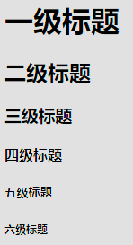
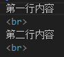
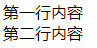
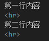
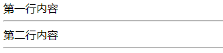
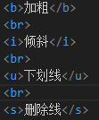
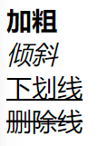

# **HTML**

## HTML 的定义
    HTML 超文本标记语言-- HyperText Markup Language
    超文本是什么? 	—— 链接
	标记是什么?	—— 标记也叫标签，带尖括号的文本

## 标签的语法
	

 - 标签**成对**出现，中间包裹内容
 - **<>里面**是标签名
 - 结束标签比开始标签多“/”，在标签名前面
 - 扩展
	 - **双标签**：成对出现的标签
	 - 单标签：只有开始标签，没有结束标签
			
			标签开头 ********** 标签结尾
			<lable>文本</lable>
		

## HTML 基本框架
```html
<html>
	<head>
		<title>网页标题</title>
	</head>
	<body>
		网页主体
	</body>
</html>
```
- html：	**整个网页**
- head：	**网页头部**，存放给**浏览器**看的代码，例如 CSS
- body：	**网页主体**，存放给**用户**看的代码，例如 图片、文字
- title：	**网页标题**

### VS Code快速生成框架
&ensp;&ensp;&ensp;&ensp;在HTML 文件 (.html) 中，!(英文) 配合 Enter / Tab 键

## 标签关系

- 父子关系（嵌套关系）
- 兄弟关系（并列关系）

## 注释
&ensp;&ensp;&ensp;&ensp;注释就是对代码的**解释和说明**，其目的是让人们能够更加轻松地了解代码。注释是编写程序时，写程序的人给一个语句、程序段、函数等的解释或提示，能**提高程序代码的可读性**。

&ensp;&ensp;&ensp;&ensp;在编写HTML代码时，我们经常要在一些关键代码旁做一下注释，这样做的好处很多，比如:**方便理解、方便查找或方便项目组里的其它程序员了解你的代码**，而且可以**方便以后你对自己代码进行修改**。

&ensp;&ensp;&ensp;&ensp;**<!--...-\->** 注释标签用来在源文档中插入注释，注释不会在浏览器中显示


## 标签
### 1、标题标签
标签名：**h1~h6**（**双**标签）1-六级
显示特定点
- 文字加粗
- **字号逐级递减**
- **独占一行**（换行）
- h1：一个网页就用一次


### 2、换行
\<br>：单标签
浏览器**不识别代码中的Enter键换行**


### 3、水平线
\<hr>：单标签


### 4、文本格式化
- strong / b：加粗
- em / i：倾斜
- ins/u：下划线
- del / s：删除线
- !
	
	两个文本格式化标签**在一行显示**
	**建议使用strong、em、ins、del标签**
	strong、em、ins、del标签自带强调含义(语义)

### 5、图像标签
```html

```
src：图像源，网页图片则为图片的链接；本地图片则为图片资源路径

路径：
  - 相对路径：从当前文件位置出发查找目标文件
    - **/** 表示进入某个文件夹里面		文件夹名字/
    - **.** 表示当前文件所在文件夹		./
    - .\. 表示上一级文件夹			.\./
  - 绝对路径：从盘符出发查找目标文件

img属性
  - alt：替换文字			图片无法显示的时候显示的文字
  - title：提示文本			鼠标悬停在图片上面的时候显示的文字
  - width：图片的宽度	值为数字，没有单位
  - height：图片的高度	值为数字，没有单位

	属性无顺序

### 6、超链接标签
```html
<a href='https://www.baidu.com'>跳转到百度</a>
```
属性
  - target="_blank"： 超链接**新窗口**打开	

href属性值写**#**，表示空链接，**不会跳转**

### 7、音频标签
```html
<audio src=''></audio>
```
常用属性
  - src：**必须属性**，音频地址，支持格式:MP3、Ogg、Wav
  - controls：显示音频控制面板
  - loop：循环播放
  - autoplay：自动播放，为了提升用户体验，浏览器一般会**禁用自动播放**功能

### 8、视频标签
```html
<video src="视频的 URL"></video>
```
常用属性
  - src：**必须属性**，音频地址，支持格式:MP4、Ogg、WebM
  - controls：显示音频控制面板
  - loop：循环播放
  - muted：静音播放
  - autoplay：自动播放，为了提升用户体验，浏览器仅支持在**静音状态**下自动播放

### 9、无语义的布局标签
作用: 布局网页 (划分网页区域，摆放内容)
  - ```div```：独占一行
  - ```span```：不换行

### 10、标签的属性
  >**标签中的属性**
  >>id: 唯一标识符，在一个页面中，id值必须唯一。
  >>class: 类名，可以给多个元素添加相同的类名，在CSS中通过类名来设置样式。
  >>width: 元素的宽度。
  >>height: 元素的高度。
  >>padding: 元素的内边距。
  >>margin: 元素的外边距。
  >>border: 元素的边框。
  >>background-color: 元素的背景色。
  >>font-size: 元素的字体大小。
  >>font-family: 元素的字体。
  >>color: 元素的字体颜色。
  >>text-align: 元素的文本对齐方式。
  >>line-height: 元素的行高。
  >>text-decoration: 元素的文本装饰。
  >>text-transform: 元素的文本大小写。
  >>text-indent: 元素的首行缩进。
  >>vertical-align: 元素的垂直对齐方式。
  >>white-space: 元素的空白处理方式。
  >>overflow: 元素内容溢出时的处理方式。
  >>display: 元素的显示方式。
  >>position: 元素的定位方式。
  >>top: 元素的顶端距离其包含块顶端的距离。
  >>bottom: 元素的底端距离其包含块底端的距离。
  >>left: 元素的左侧距离其包含块左侧的距离。
  >>right: 元素的右侧距离其包含块右侧的距离。
  >>z-index: 元素的堆叠顺序。
  >>float: 元素的浮动方式。
  >>clear: 元素的清除方式。
  >>cursor: 元素的鼠标指针样式。
  >>opacity: 元素的透明度。
  >>content: 元素的内容。
  >>quotes: 元素的引用。
  >>counter-reset: 元素的计数器重置。
  >>countr-increment: 元素的计数器递增。
  >>list-style: 元素的列表样式。
  >>outline: 元素的轮廓。
  >>clip: 元素的裁剪。
  >>filter: 元素的滤镜。
  >>transform: 元素的变换。
  >>transition: 元素的过渡。
  >>animation: 元素的动画。
  >>box-shadow: 元素的阴影。
  >>border-radius: 元素的圆角。
  >>border-image: 元素的边框图片。
  >>background-image: 元素的背景图片。
  >>background-repeat: 元素的背景平铺方式。
  >>background-position: 元素的背景位置。
  >>background-size: 元素的背景尺寸。
  >>background-attachment: 元素的背景固定方式。
  >>background-clip: 元素的背景裁剪方式。
  >>background-origin: 元素的背景起点。
  >>background-blend-mode: 元素的背景混合模式。
  >


## 列表
分类：无序列表、有序列表、定义列表。
### 1、无序列表
标签：ul 嵌套 li，ul是无序列表，li是列表条目
```html
<ul>
	<li>第一项</li>
	<li>第二项</li>
	<li>第三项</li>
	...
</ul>
```
注意事项
  - **ul 标签**里面**只能包裹li 标签**
  - **li 标签**里面**可以包裹任何内容*
### 2、有序列表
标签: ol 嵌套 li，ol是有序列表，li 是列表条目。
```html
<ol>
	<li>第一项</li>
	<li>第二项</li>
	<li>第三项</li>
	...
</ol>
```
注意事项
  - **ol 标签**里面**只能包裹li 标签**
  - **li 标签**里面**可以包裹任何内容*

### 3、定义列表
标签: dl 嵌套 dt 和 dd，dl是定义列表，dt 是定义列表的标题，dd 是定义列表的描述 /详情。
```html
<dl>
	<dt>列表标题</dt>
	<dd>列表描述/内容</dd>
	...
</dl>
```
注意事项
  - **dl 标签**里面**只能包裹dt、dd 标签**
  - **dt、dd 标签**里面**可以包裹任何内容*

## 表格
标签: table 嵌套 tr，tr 嵌套 td / th
  - table：表格
  - tr：行
  - th：**表头**单元格
  - td：**内容**单元格

提示:在网页中，表格默认没有边框线，使用 border 属性可以为表格添加边框线。

### 1、结构标签
作用：用表格结构标签把内容划分区域，让表格结构更清晰，语义更清晰。
  - thead：表格头部----表格头部内容
  - tbody：表格主体----主要内容区域
  - tfoot：	表格底部----汇总信息区域

### 2、合并单元格
作用: 将多个单元格合并成一个单元格，以合并同类信息。
合并单元格的步骤:

 1. 明确合并的目标
 2. 保留最左最上的单元格，添加属性(取值是数字，表示需要合并的单元格数量)
		 - 跨行合并，保留最上单元格，添加属性 rowspan
		 - 跨列合并，保留最左单元格，添加属性 colspan
 3. 删除其他单元格


## 表单
作用：收集用户信息。
使用场景：
- 登录页面
- 注册页面
- 搜索区域

### 1、input
 input 标签 **type** 属性值不同，则功能不同
 input **单标签**
 input 标签**不换行**
```html
<input type=''>
```

input属性
- **type：设置输入框类型，如text、password、radio、checkbox、file等。**
- **name：设置输入框的名称，用于在表单提交时标识输入框。*控件分组，同名控件为一组***
- **value：设置输入框的默认值。**
- **checked：设置单选框或多选框默认选中。**
- disabled：设置输入框是否禁用。
- readonly：设置输入框是否只读。
- maxlength：设置输入框的最大字符长度。
- **placeholder：设置输入框的提示文字。**
- autofocus：设置输入框自动获取焦点。
- form：设置输入框所属的表单。
- accept：设置文件上传的类型。
- multiple：设置文件上传是否可以多选。


type属性：
- text：文本框，用于输入单行文本
- password：密码框
- radio：单选框
- checkbox：多选框
- file：上传文件

### 2、下拉菜单
select 嵌套 option
select 是下拉菜单整体，option是下拉菜单的每一项。
```html
<select>
	<option>第一项</option>
	<option>第二项</option>
	<option>第三项</option>
	<option selected>第四项</option>
	...
</select>
```

select属性
  - name：设置下拉列表的名称，用于在表单提交时标识下拉列表。
  - value：设置下拉列表的默认值。
  - selected：默认选项
  - disabled：设置下拉列表是否禁用。
  - multiple：设置下拉列表是否可以多选。

### 文本域
作用：多行输入文本的表单控件。
标签：textarea， 双标签
```html
<textarea>默认提示文字</textarea>
```
textarea属性
  - name：设置文本域的名称，用于在表单提交时标识文本域。
  - value：设置文本域的默认值。
  - disabled：设置文本域是否禁用。
  - readonly：设置文本域是否只读。
  - maxlength：设置文本域的最大字符长度。
  - placeholder：设置文本域的提示文字。
  - autofocus：设置文本域自动获取焦点。
  - form：设置文本域所属的表单。


### lable标签
作用：网页中，某个标签的说明文本。

经验：用label标签**绑定文字和表单控件的关系**，**增大表单控件的点击范围**

#### label增大表单控件的点击范围
- 写法一
  - label 标签只包裹内容，不包裹表单控件
  - 设置label标签的 for 属性值和表单控件的id 属性值相同
```html
<input type='radio' id='man'>
<lable for='man'>男</lable>
```
		
- 写法二
  - 使用label 标签包裹文字和表单控件，不需要属性
```html
<label><input type="radio"> 女</label>
```

提示：支持 abel 标签增大点击范围的表单控件:文本框、密码框、上传文件、单选、多选框、下拉菜单、文本域等等

### button按钮
```html
<button type=''>按钮</button>
```
> buton属性
>>type：设置按钮类型，如submit、reset、button等。
>>value：设置按钮的文字。
>>>disabled：设置按钮是否禁用。
>>
>>form：设置按钮所属的表单。

 type属性
   - submit：提交按钮，点击后可以提交数据到后台(默认功能)
   - reset：重置按钮，点击后将表单控件恢复默认值
  -  button：普通按钮，默认没有功能，一般配合JavaScript 使用
  没有填写type，则默认是submit

## 字符实体
作用:在网页中显示预留字符，比如“<”符号
  - 空格：&nbsp\;
  - 小于号：&lt\;
  - 大于号：&gt\;
  - “&”开头，“;”结尾


<!--stackedit_data:
eyJoaXN0b3J5IjpbLTIyMTExOTA3MiwtNTc1MzI1NzI2LC01Nj
YwOTQ3NTAsMTE5MTgyNDQ5MywxMTkxODI0NDkzXX0=
-->